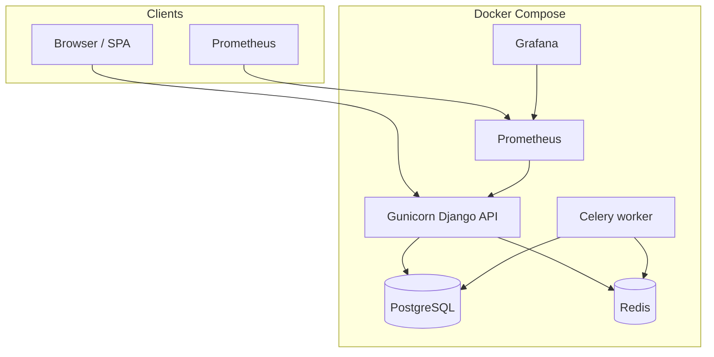

# R&D Talent Scraper

## Project Overview

**R&D Talent Scraper** is a backend web application designed to collect research and development (R&D) related job vacancies and analyze the required skills from their descriptions.

In the MVP stage, the system collects vacancy data from the HH platform, extracts key skills using a dictionary-based approach, and provides a REST API for searching, filtering, and browsing vacancies.

---

# Tech Stack

**Backend**

* Python
* Django
* Django REST Framework

**Database**

* PostgreSQL

**Async Processing**

* Celery
* Redis

**Containerization**

* Docker
* Docker Compose

**Deployment**

* Render

**Version Control**

* GitHub

---

# Project Structure

```
rd
│
├── backend/                # Django backend application
│
├── deploy/                 # Production: entrypoint, Prometheus, Grafana provisioning
│
├── .env.example            # Environment variables example
│
├── docker-compose.yml      # Dev stack (runserver, bind mount)
│
├── docker-compose.prod.yml # Production overlay (Gunicorn, Celery, no bind mount)
│
├── Dockerfile              # Multi-stage API image (Gunicorn, collectstatic)
│
├── requirements.txt        # Dependencies (django-prometheus from Git for Django 6)
│
├── requirements-dev.txt    # Development dependencies
│
├── pyproject.toml          # Formatter and import sorting configuration
│
├── .flake8                 # Linter configuration
│
└── README.md
```

---

# Environment Setup

### 1. Clone the repository

```
git clone https://github.com/your-username/rd-talent-scraper.git
cd rd-talent-scraper
```

### 2. Create virtual environment

```
python -m venv .venv
source .venv/bin/activate
```

### 3. Install dependencies

```
pip install -r requirements.txt
pip install -r requirements-dev.txt
```

### 4. Configure environment variables

Create `.env` file using the example:

```
cp .env.example .env
```

Example variables:

```
DEBUG=True
SECRET_KEY=your_secret_key
DATABASE_URL=postgres://user:password@db:5432/talent_db
REDIS_URL=redis://redis:6379/0
```

### 5. Run with Docker

```
docker compose up --build
```

This will start:

* Django backend
* PostgreSQL database
* Redis broker
* Celery worker

---

# Code Style

The project follows consistent Python code style rules.

**Formatter**

* Black

**Import Sorting**

* isort

**Linting**

* Flake8

Developers should run formatters before committing code:

```
black .
isort .
flake8
```

Configuration files:

* `pyproject.toml`
* `.flake8`

---

# Branching Strategy

The project uses a simple Git workflow.

**Main branches**

`main`
Stable version of the project.

`dev`
Active development branch.

**Feature branches**

New features are developed in separate branches:

```
feature/auth
feature/vacancy-model
feature-skill-extraction
```

Development process:

1. Create feature branch from `dev`
2. Implement feature
3. Commit changes
4. Open Pull Request to `dev`
5. Merge after review

---

# Development Status

## Week 2 — Environment Setup**

Completed tasks:

* GitHub repository created
* README documentation prepared
* Project structure initialized
* Development environment configured
* Code style rules defined
* Branching strategy agreed

---

## Week 3 — Authentication & Authorization

Implemented JWT-based authentication using Django REST Framework.

Features:
- User registration
- Login with JWT tokens
- Token refresh
- Protected endpoint `/api/auth/me/`
- Role support (user/admin)

---

## Week 4 — Database Design & Models

The database schema for the R&D Talent Scraper was designed and implemented using Django ORM.

The schema includes the following entities:

- **User** – system users
- **Vacancy** – job postings collected from external sources
- **Skill** – technologies and competencies extracted from vacancies
- **Watchlist** – skills tracked by users

Relationships between entities were implemented using foreign keys and many-to-many associations to ensure a normalized and scalable database structure.

---

## Week 5 — Core Functionality (Part 1)

This week focused on implementing basic CRUD operations for the main system entities using Django REST Framework.

### Implemented functionality

- Created API endpoints for:
  - `Vacancy`
  - `Skill`
  - `Watchlist`

### Access control

- Regular users can:
  - view vacancies and skills
  - use search/filter features
  - manage only their own watchlist

- Admin users can:
  - create, update, and delete vacancies
  - create, update, and delete skills

---

## Week 6 — Core Functionality (Part 2)

### Implemented functionality

- Vacancy search by keyword
- Filtering vacancies by location, source, and skill
- Ordering vacancies by publication date
- Improved API response structure for vacancy-related data
- Added validation and ensured correct response codes for invalid requests

---
## Week 7 — Web Scraping & Skill Extraction

### Implemented functionality

- Django management command for scraping HH.ru API
- R&D vacancy detection using keyword filtering
- Key skills extraction from HH.ru `key_skills` field
- Automatic skill linking to vacancies via many-to-many relationship
- Full description HTML content preservation
- Duplicate prevention using `source` and `external_id` constraints

---

## Week 8 — Frontend Development

### Implemented functionality

- React + Vite frontend application
- Complete UI design with modern components
- Six main pages: Home, Vacancies, Vacancy Detail, Watchlist, Login, Register
- Responsive design with mobile support
- Search and filter functionality with checkboxes for skills and locations
- Pagination (15 jobs per page)
- Save/Remove vacancy to watchlist
- JWT authentication integration
- Skills modal with all available skills
- Footer component with links and social media

### Features

- Modern design system with CSS variables
- Sticky navbar with auth state management
- Skills and locations fetched dynamically from API
- HTML description rendering with proper formatting
- Back navigation from watchlist to detail page
- Conditional UI based on authentication state

---

## Week 9 — Admin Panel

- Django admin configured for User, Vacancy, Skill, VacancySkill, Watchlist
- Added search, filters, ordering, pagination
- Added inline editing for vacancy skills
- Improved admin usability for content management

---

## Production deployment and monitoring

### Architecture (overview)



- **API**: Django + DRF behind **Gunicorn** (production overlay), **WhiteNoise** for collected static files, **JWT** and existing apps unchanged.
- **Health**: `GET /health/` (liveness), `GET /health/ready/` (DB readiness for orchestrators).
- **Metrics**: `GET /metrics` via **django-prometheus** (PyPI 2.4.1 does not allow Django 6; this repo pins a **Git commit** that supports Django 6 — see `requirements.txt`).
- **Logs**: rotating file under `DJANGO_LOG_DIR` (default: repo `logs/` locally, `/app/logs` in Compose) plus console.
- **Security**: `DJANGO_ENV=production` enforces `DEBUG=False`, strict `ALLOWED_HOSTS`, and optional TLS-related flags via environment variables (see `.env.example`).

### Local development (current default)

```bash
cp .env.example .env
docker compose up --build
```

- **web** uses **Django `runserver`** with the repo bind-mounted at `/app` (hot reload).
- **PostgreSQL** data persists in the `postgres_data` volume (earlier compose omitted this; it is now attached).

### Production stack (Gunicorn + Celery + monitoring)

1. Copy and edit **`.env`**: set `DJANGO_ENV=production`, `DEBUG=False`, strong `SECRET_KEY`, real `ALLOWED_HOSTS`, `CORS_ALLOWED_ORIGINS`, `CSRF_TRUSTED_ORIGINS`, and TLS flags if you terminate HTTPS in front of the app (`USE_X_FORWARDED_HOST`, `SESSION_COOKIE_SECURE`, `CSRF_COOKIE_SECURE`, `SECURE_SSL_REDIRECT`, `SECURE_HSTS_*`).

2. Start the production overlay (no source bind-mount; image runs **Gunicorn** and a **Celery** worker):

```bash
docker compose -f docker-compose.yml -f docker-compose.prod.yml up -d --build
```

3. Optional **Prometheus + Grafana** (same as dev):

```bash
docker compose -f docker-compose.yml -f docker-compose.prod.yml --profile monitoring up -d --build
```

| Service    | Port (host) | Notes                                      |
|-----------|-------------|---------------------------------------------|
| API       | 8000        | Gunicorn when using `docker-compose.prod.yml` |
| Prometheus| 9090        | Profile `monitoring`                        |
| Grafana   | 3000        | Default login `admin` / `GRAFANA_ADMIN_PASSWORD` |

- **Grafana**: datasource **Prometheus** is provisioned automatically. Dashboard **“Django API (django-prometheus)”** is loaded from `deploy/grafana/provisioning/dashboards/json/django-overview.json` (edit or replace JSON; re-provision on container recreate).
- **Prometheus** config: `deploy/prometheus/prometheus.yml` (scrape target `web:8000`, path `/metrics`).
- **Multi-worker metrics**: with Gunicorn, set `PROMETHEUS_MULTIPROC_DIR` (already set in `docker-compose.prod.yml` for `web`). The entrypoint clears that directory on each container start before workers start.

### CI / server deploy

The GitHub Actions deploy step uses:

`docker compose -f docker-compose.yml -f docker-compose.prod.yml up -d --build`

Ensure the server repository path contains **both** compose files and a production-ready `.env`.

### Useful endpoints

| Path            | Purpose                          |
|----------------|-----------------------------------|
| `/health/`     | Liveness (no DB check)            |
| `/health/ready/` | Readiness (`SELECT 1` on default DB) |
| `/metrics`     | Prometheus text exposition        |

### Image build notes

- The **Dockerfile** is multi-stage: wheels (including **git** for the django-prometheus VCS line) are built in the first stage; the runtime image installs from local wheels only (**no git** in the final image).
- **Collectstatic** runs at image build time; admin static assets are served via WhiteNoise when `DEBUG=False`.